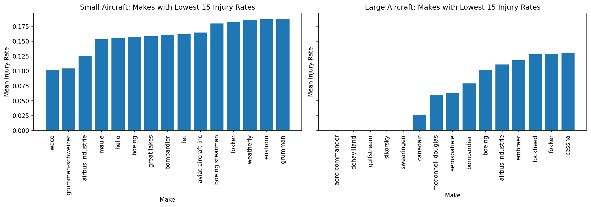
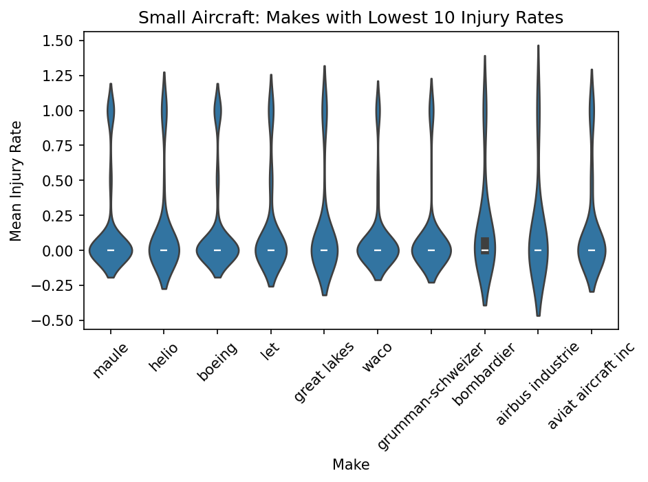
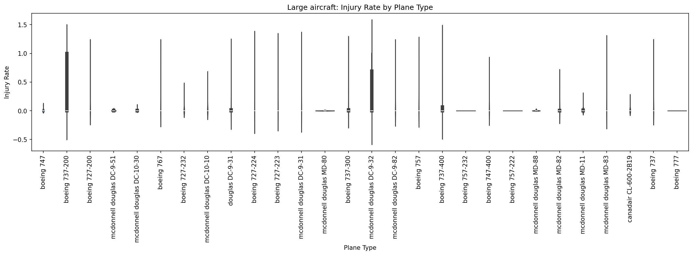
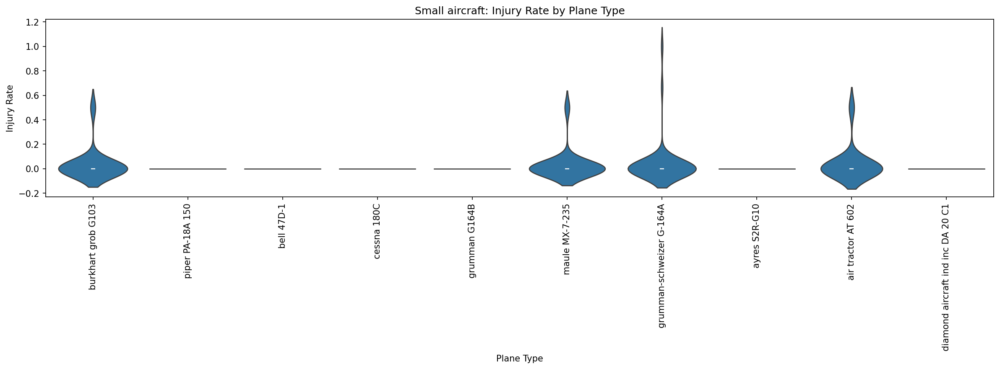
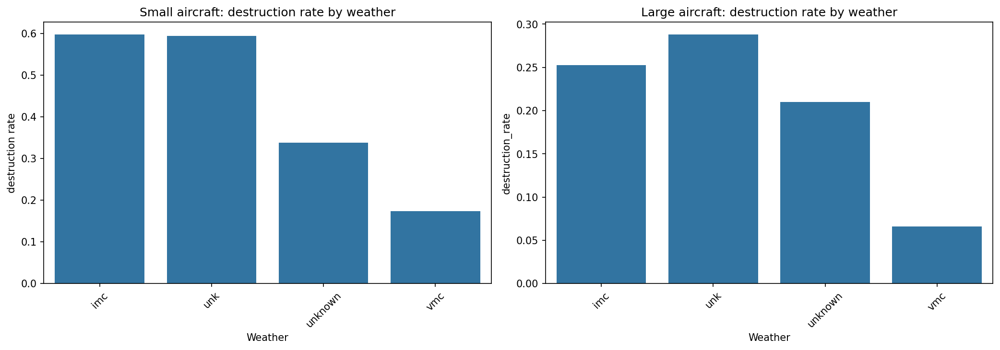
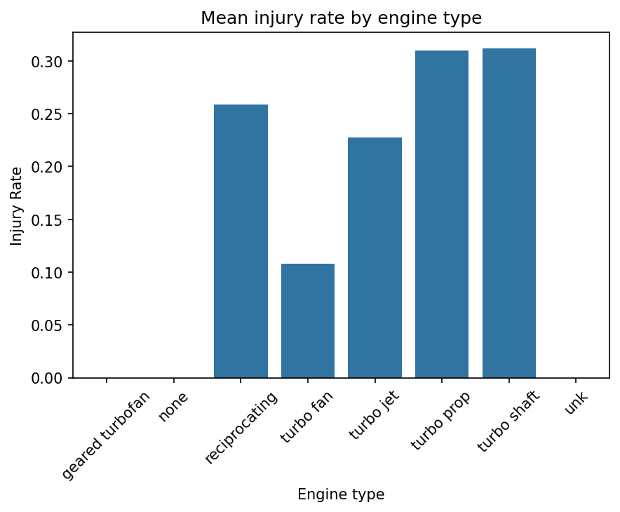

# Aviation Accident Analysis

## Small and large aircraft injury rate

## Small Aircraft Makes Injury Rate 

## Large Aircraft Makes Injury Rate 

# Large Aircraft Plane Type Injury Rate 

### For large planes: 
### Highest average injury rate is in Boeing 737-200 and Mcdonnell Douglas DC-9-32. 

### For small planes: 
### Highest average injury rate is in burkhart grub g103, maule MX-7-235,grumman-schweizer G-164A, air tractor AT 602

# Small Aircraft Plane Type Injury Rate

# Small and Large Aircraft Destruction Weather Rate 

### Flying airplanes in imc and unk weather seems to result in the most damage to airplanes.  

# Engine Type and its effect on injury rate

### Turbo prop,Turbo shaft and reciprocating engines seem to cause the most serious injuries in the event of an accident  

